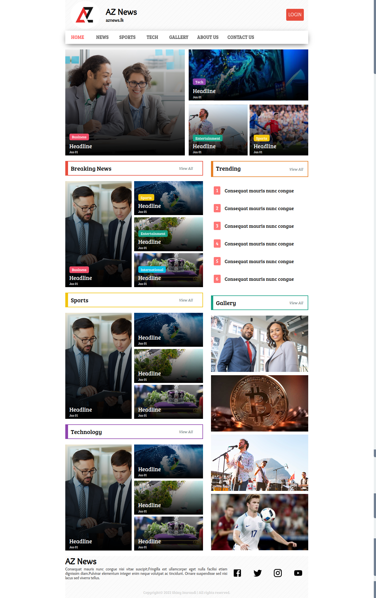
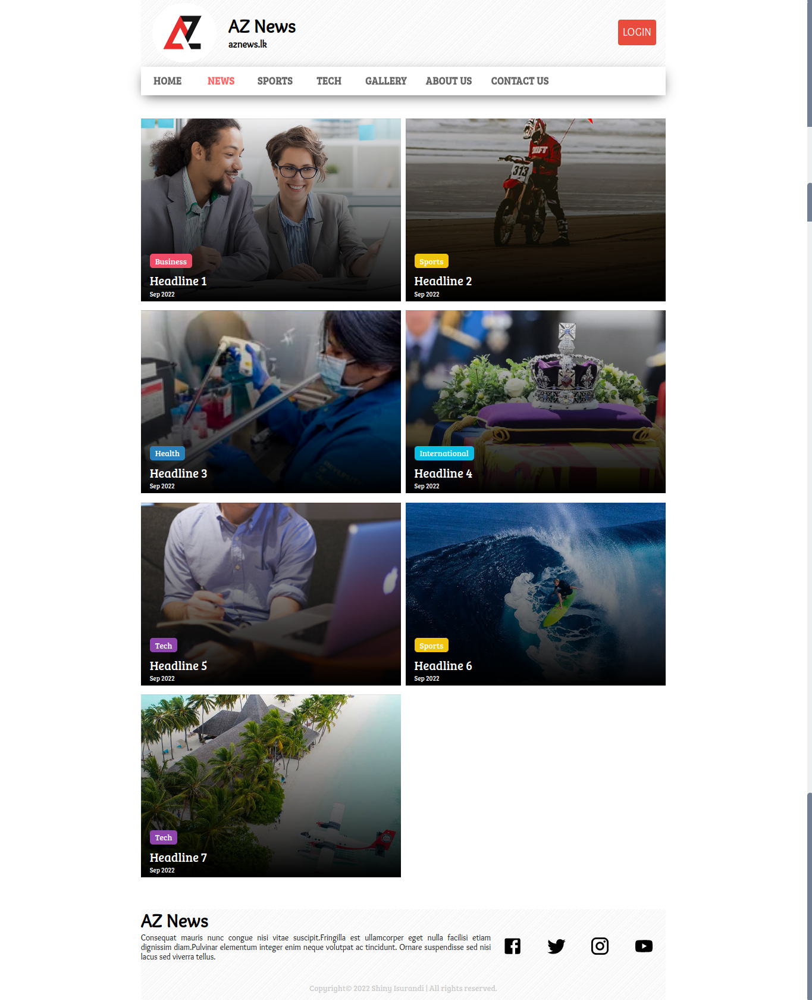
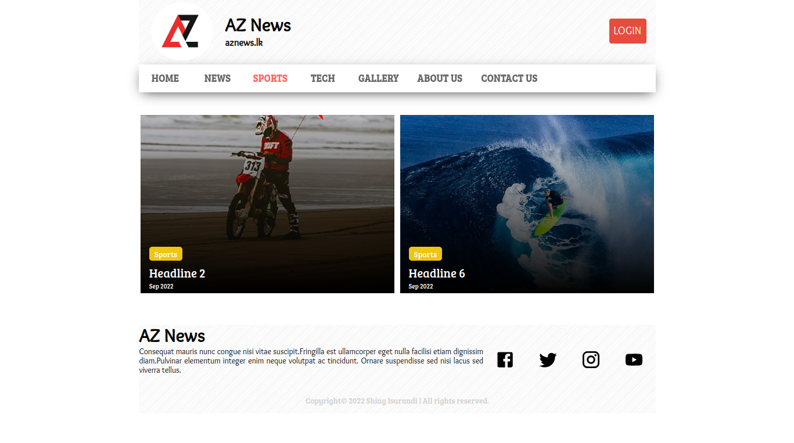
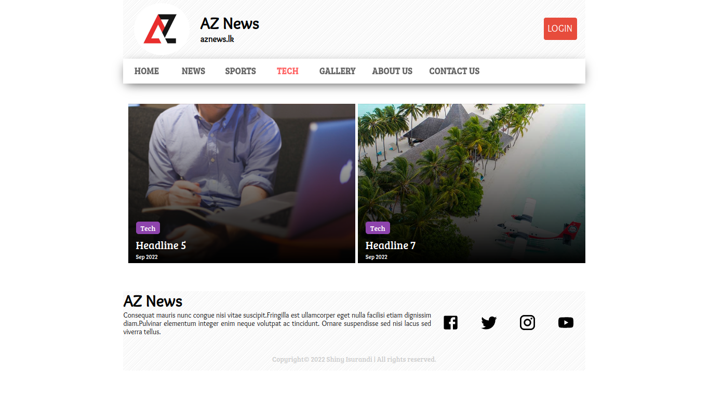
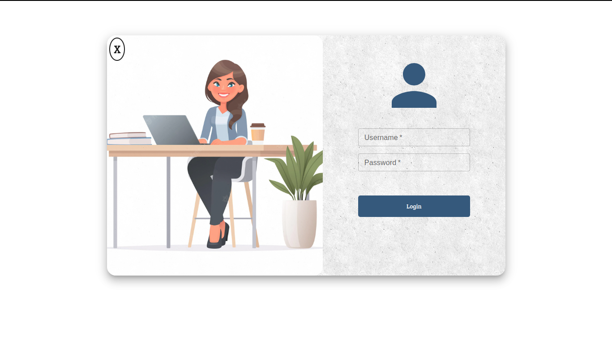
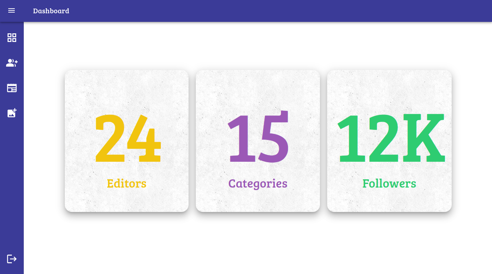
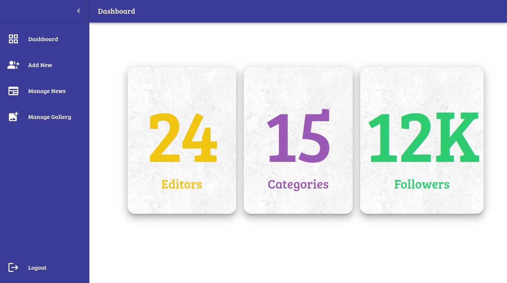
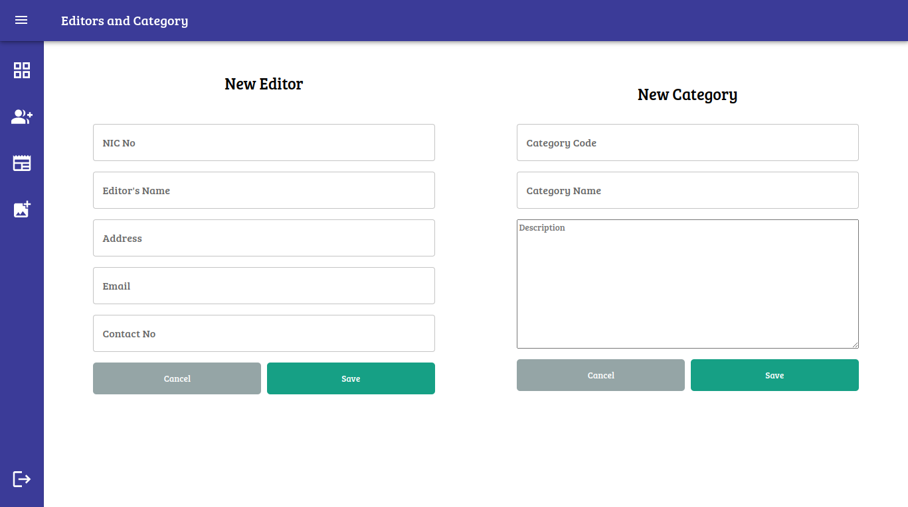
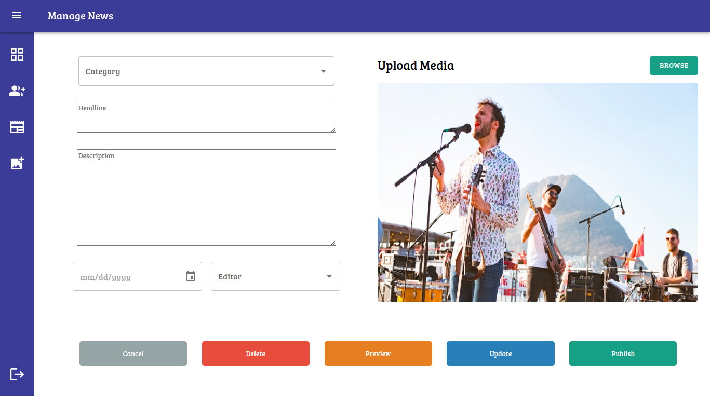

# AZ News

 

### This is a simple news website with a simple admin dashboard done using JavaScript

 

## Technology Stack :

- MongoDB
- Express JS
- React JS
- Node JS

 

## Links :

- [Site Map](https://www.gloomaps.com/meZkj9crcr)
- [Wireframe](https://wireframe.cc/pro/pp/39f47649e582839)

 

   
   
   
   
   
   
   
   
   
   
